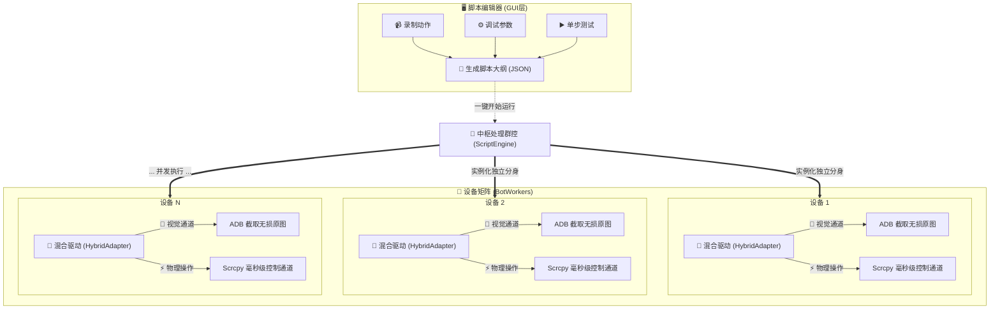

# 模拟器 RPA 矩阵云控系统 v0.1

基于 Python + PyQt6 的高级自动化群控系统，采用 **ADB (无损视觉) + Scrcpy (极速控制)** 的混合驱动 (Hybrid Adapter) 架构。
支持实时录制、可视化脚本编辑、多设备并发执行任务。

## 📁 项目目录结构

```
模拟器/0.1/
├── gui.py                  # GUI 入口文件（启动: python gui.py）
├── gui/                    # GUI 模块包
│   ├── __init__.py         # 包入口
│   ├── constants.py        # 配色常量、字体工具函数
│   ├── workers.py          # 截图后台线程（录制预览用途）
│   ├── widgets.py          # ScreenshotWidget 截图预览与坐标拾取控件
│   ├── main_window.py      # MainWindow 主窗口（布局、群控开关逻辑）
│   └── tabs/               # 功能页子包
│       ├── library_tab.py  # 🖼 图库：模板图片管理
│       ├── script_tab.py   # 📜 脚本：动作录制、参数调整
│       └── loop_script_tab.py # � 循环：多脚本组合循环运行
│
├── config.py               # 全局配置（路径、设备定义）
├── adb_utils.py            # ADB 底层操作（极速内存截图、设备获取）
├── scrcpy_client.py        # Scrcpy 客户端（H.264 解码、TCP 控制通道、Headless模式）
├── device_adapter.py       # 设备操作适配器 (AdbAdapter / ScrcpyAdapter)
├── script_engine.py        # 脚本执行引擎（RPA 大脑：解析并执行 JSON 任务）
├── script_model.py         # 脚本数据模型（动作节点基石、保存与加载）
├── image_engine.py         # 图像感知引擎（多尺度、多阈值模板匹配）
├── crop_utils.py           # 图像裁剪与预处理工具
├── template_meta.py        # 模板图片元数据操作类
├── bot_worker.py           # RPA 线程实例 (每个受控设备的自治载体)
├── shop_bot.py             # [遗留] 早期自动购买逻辑
├── recovery.py             # [遗留] 异常恢复逻辑
├── main.py                 # 命令行无 UI 入口
├── targets/                # 本地图像匹配库 (目标物图片)
├── popups/                 # 本地图像匹配库 (弹窗叉号等)
├── Scripts/                # 开发完成的 RPA 脚本文件 (JSON) 存放处
└── requirements.txt        # 环境依赖列表
```

## 🚀 快速启动

```bash
# 安装依赖
pip install -r requirements.txt

# 启动 GUI (脚本编辑器模式)
python gui.py
```

## 🧠 核心架构理念 (RPA Matrix)

本项目不仅仅是一个传统的“单线程同步器”，而是一个**高度并行的 RPA 自动化群控矩阵**。

1. **可视化 IDE 界面**：当前运行的带画面的界面，其主要身份是“脚本开发与调试器”。用来录制动作、拾取坐标、生成 JSON 格式的标准业务大纲。
2. **感知-执行分离驱动 (Hybrid Adapter)**：
   - **ADB 通道 (眼睛)**：负责 `get_frame()` 获取绝对无损的实时画面，供 OpenCV 进行精准图色比对，命中率极高。
   - **Scrcpy 控制通道 (手脚)**：在启动群控时，为每台设备建立免音视频流（`video=false`）的极速 TCP 通道，专职下发毫秒级的 `click` 和带复杂贝塞尔曲线的 `swipe_path` 防封操作。
3. **独立自治的并行端**：点击运行后，引擎会为每台设备实例化独立的 `BotWorker`。所有设备基于同一套 JSON 剧本，各自独立找图、各自分析屏幕局势、各自点击，彻底杜绝单设备卡顿导致整个机房翻车的问题。



## 🔑 核心功能

| 功能 | 说明 |
|------|------|
| **ADB 管理** | 自动扫描雷电/MUMU 模拟器 ADB，支持切换和重启 |
| **截图预览** | 实时同步模拟器画面（scrcpy 30fps+），支持坐标拾取 |
| **区域截图** | 鼠标拖拽选区 → 裁切保存为模板图片 |
| **图库管理** | 缩略图网格展示模板，支持刷新和删除 |
| **自动购买** | 神秘商店物品图像识别 + 自动点击购买 |
| **参数热更** | 运行中实时调整匹配阈值、延迟等参数 |

## 📦 依赖

- Python 3.10+
- PyQt6
- OpenCV (opencv-python)
- numpy
- py-scrcpy-client (可选，用于实时同步)
